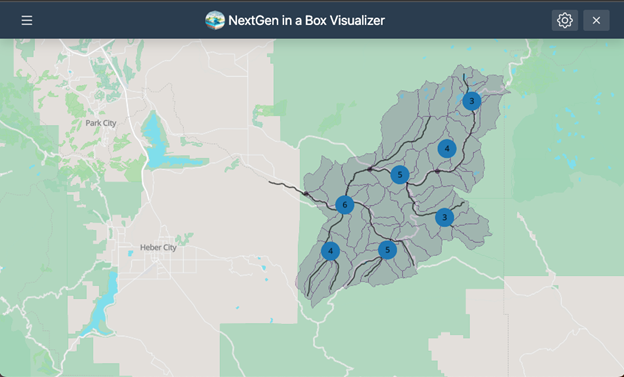
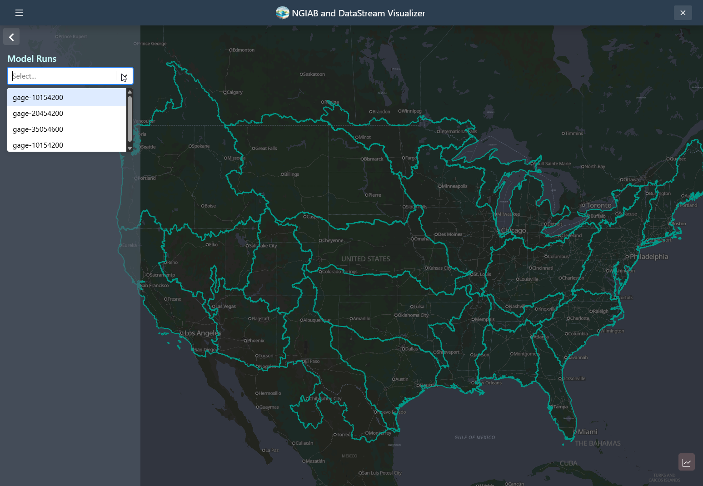
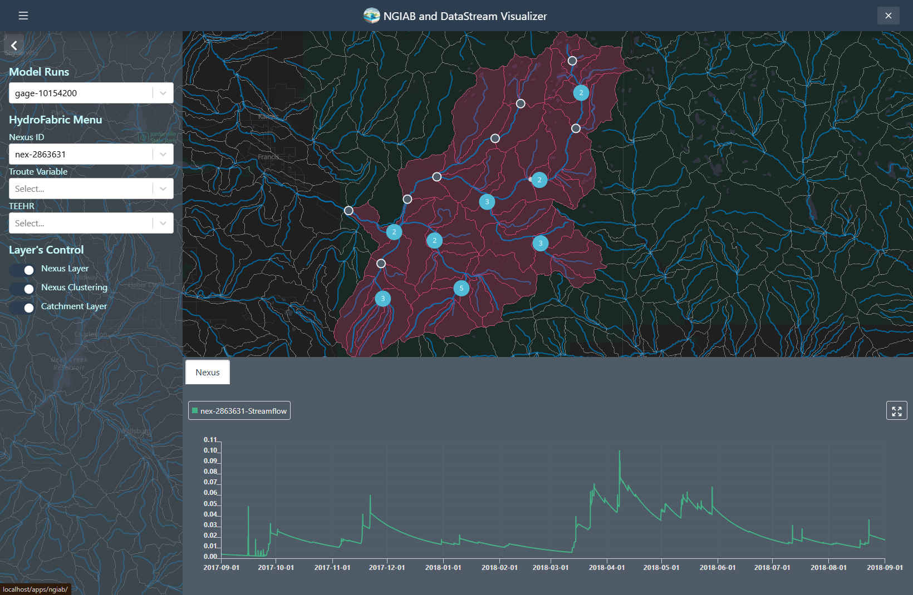
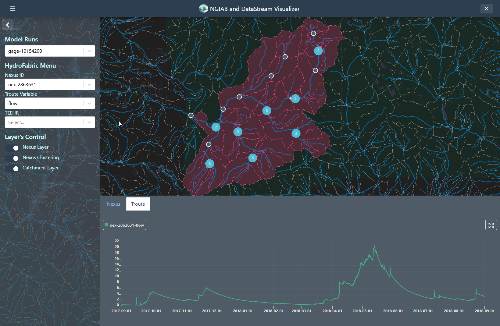
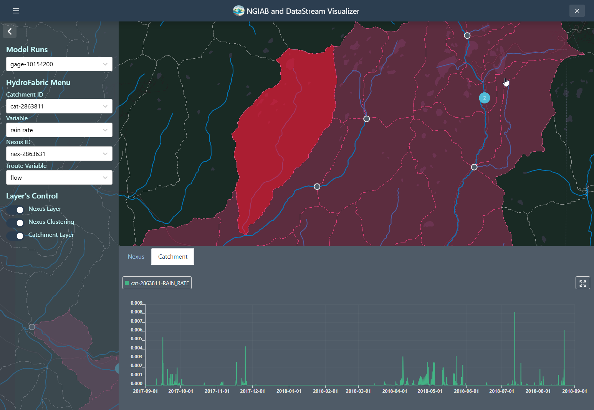

# NGIAB Output Visualizer

| | |
| --- | --- |
|  | Funding for this project was provided by the National Oceanic & Atmospheric Administration (NOAA), awarded to the Cooperative Institute for Research to Operations in Hydrology (CIROH) through the NOAA Cooperative Agreement with The University of Alabama (NA22NWS4320003). |

This app was created using an experimental Tethys + React app scaffold. It uses React for the frontend of the app and Tethys as the backend.



The Data Visualizer component provides:
- **Geospatial visualization** of catchments and nexus points
- **Time series analysis** of catchments, nexus points, and troute variables
- **TEEHR output visualization** including metrics and interactive plots

Built on the Tethys Platform [(Swain et al., 2015)](https://doi.org/10.1016/j.envsoft.2015.01.014), it enables web-based exploration of model outputs [(CIROH, 2025)](https://github.com/CIROH-UA/ngiab-client).

## Usage Guide

### Assited using `ViewOnTethys` Script

Like TEEHR, the Data Visualizer can be activated upon execution of the main NGIAB guide script, `guide.sh`. A separate `viewOnTethys.sh` script is also available in the NGIAB-CloudInfra repository.

Once a run is complete, users can launch the Data Visualizer through their web browser when prompted by the guide script. Although TEEHR's outputs can be displayed within the Data Visualizer, this tool is primarily designed to provide a broad overview of model results. Users seeking TEEHR's more advanced analysis features can still access them outside the Data Visualizer.

One of the advantages of the `viewOnTethys.sh` script is that it allows the user to keep multiple outputs for the same hydrofabric. It prompts the user if they want to use the same output directory by renaming it and adding it to the collection of outputs or if they want to overwrite it.

```bash
  ⚠ ~/ngiab_visualizer is not empty.
  → Keep (K) or Fresh start (F)? [K/F]: k
ℹ Reclaiming ownership of ~/ngiab_visualizer  (sudo may prompt)...
  ⚠ Directory exists: ~/ngiab_visualizer/gage-10154200
  → Overwrite (O) or Duplicate (D)? [O/D]: o
  ✓ Overwritten ➜ ~/ngiab_visualizer/gage-10154200
  ℹ It appears in the visualizer's run picker once the portal is up.
```

You should be able to see multiple outputs through the UI:

{alt='A screenshot of the  NGIAB and DataStream Visualizer web interface. The map displays the ability of the visualizer to use multiple outputs'}

#### Visualizer Directory Organization

The Visualizer keeps model run outputs in a directory named `ngiab_visualizer`, and **that
directory is the registry**. A run is registered by being there: one directory per run, each
holding a `manifest.json` the visualizer writes when it ingests the run. There is no database
table of runs, no configuration file to hand-edit, and nothing to register.

`./ViewOnTethys.sh -d <path>` copies a run in and prepares it, and it appears in the picker
within ten seconds. Preparing is what writes the manifest -- a directory without one is listed
as unusable, with the reason, rather than hidden.

If you copy a directory in yourself, prepare it once:

```bash
docker exec tethys-ngen-portal \
  tethys manage write_manifest --path /var/lib/tethys_persist/ngiab_visualizer/<name>
```

Or convert its outputs to parquet at the same time, which is what the launcher runs:

```bash
docker exec tethys-ngen-portal \
  tethys manage convert_outputs --path /var/lib/tethys_persist/ngiab_visualizer/<name>
```

Either is safe to re-run: the manifest is derived from the run's own contents, so an
unchanged run rewrites identical files.

The `~/.ngiab_visualizer_db` mount still matters, but for a different reason than it used to.
It no longer holds the run registry. It holds the portal's own database -- sign-ins and
sessions -- which became worth persisting when changing a run started requiring one. Without
that mount you sign in again after every restart.

**Deleting a run deletes it.** The `×` button next to the run picker removes the run's
directory and everything in it, and asks first. This changed: it used to only forget the run
and leave the data alone. With the directory *being* the registry, a removal that only forgot
would put the run back on the next scan, so it deletes for real. Only a signed-in user can.

**Changing a run requires signing in; viewing does not.** The portal stays open -- share a
`?model_run_id=` link with anyone -- but deleting a run or uploading one needs an account.
Sign in at `/accounts/login`.

##### Upgrading from an earlier version

Runs registered in the old database are converted on the first start after the upgrade, and
the shared links they were given keep working. Two things to know:

- **A run outside `~/ngiab_visualizer` is not carried over.** `NGIAB_SCAN_ROOTS` used to let
  the importer offer runs from other mounts; there is no importer now, and a directory
  outside the storage root will not be listed. The upgrade names any it finds, with the path.
  Move or copy them under `~/ngiab_visualizer` before upgrading.
- **Downgrading afterwards is not supported.** The upgrade drops the old registry table, and
  an older image expects it. Keep a copy of `~/.ngiab_visualizer_db` if you may want to go
  back.

##### Hosted deployments

Set `NGIAB_STORAGE_BACKEND=s3` and configure a `ngiab_runs` entry in Django's `STORAGES`
setting; runs are then addressed as objects rather than files and read with DuckDB over
`httpfs`. A hosted deployment **refuses to start** on the image's baked `admin`/`pass`
superuser or its default `TETHYS_SECRET_KEY`, both of which are public: supply
`PORTAL_SUPERUSER_NAME`, `PORTAL_SUPERUSER_PASSWORD` and `TETHYS_SECRET_KEY` of your own.

### Unassisted Usage

First create the `MODELS_RUNS_DIRECTORY` directory at `"$HOME/ngiab_visualizer"` and the
`DB_DIRECTORY` directory at `"$HOME/.ngiab_visualizer_db"`. The first holds the runs and is
the registry. The second holds the portal's own database -- sign-ins and sessions -- which is
worth persisting now that changing a run requires signing in.

Copy your `my-ngen-output` into `MODELS_RUNS_DIRECTORY`, start the container as below, then
give the run its manifest:

```bash
docker exec tethys-ngen-portal \
  tethys manage write_manifest \
    --path /var/lib/tethys_persist/ngiab_visualizer/my-ngen-output \
    --label my-ngen-output
```

Define the env variables and running the container

```bash
# Set environment variables
export TETHYS_CONTAINER_NAME="tethys-ngen-portal"        \
       TETHYS_REPO="awiciroh/tethys-ngiab"               \
       TETHYS_TAG="latest"                               \
       NGINX_PORT=80                                     \
       MODELS_RUNS_DIRECTORY="$HOME/ngiab_visualizer"    \
       DB_DIRECTORY="$HOME/.ngiab_visualizer_db"         \
       TETHYS_PERSIST_PATH="/var/lib/tethys_persist"     \
       SKIP_DB_SETUP=false                               \
       CSRF_TRUSTED_ORIGINS="[\"http://localhost:${NGINX_PORT}\",\"http://127.0.0.1:${NGINX_PORT}\"]"
```
# Run container

```bash
docker run --rm -d \
  -v "$MODELS_RUNS_DIRECTORY:$TETHYS_PERSIST_PATH/ngiab_visualizer" \
  -v "$DB_DIRECTORY:$TETHYS_PERSIST_PATH/db" \
  -p "$NGINX_PORT:$NGINX_PORT" \
  --name "$TETHYS_CONTAINER_NAME" \
  -e MEDIA_ROOT="$TETHYS_PERSIST_PATH/media" \
  -e MEDIA_URL="/media/" \
  -e SKIP_DB_SETUP="$SKIP_DB_SETUP" \
  -e NGINX_PORT="$NGINX_PORT" \
  -e CSRF_TRUSTED_ORIGINS="$CSRF_TRUSTED_ORIGINS" \
  "${TETHYS_REPO}:${TETHYS_TAG}"
```
Verify deployment:

```bash
docker ps
# CONTAINER ID   IMAGE                          PORTS                 NAMES
# b1818a03de9b   awiciroh/tethys-ngiab:latest   0.0.0.0:80->80/tcp    tethys-ngen-portal
```

Access at: http://localhost:80

### Running with rootless Podman

The image is also compatible with rootless Podman (no `sudo` required). The main differences vs. Docker:

- Use port `8080` (rootless cannot bind privileged ports < 1024). Set `NGINX_PORT=8080`.
- Pass `--userns=keep-id:uid=1011` so files written by the container's `www` user (UID 1011 in the Tethys base image) appear with the invoking user's UID on the host.
- Append `:Z` to bind mounts on SELinux-enforcing hosts (RHEL, Fedora, Rocky, etc.).
- Build with `--format docker` so the `HEALTHCHECK` directive is preserved (Podman's default OCI format strips it).
- Wrap `ALLOWED_HOSTS` in literal outer double-quotes so the value survives the salt-state shell rendering inside the container.

```bash
# Build (Docker format so HEALTHCHECK is preserved)
podman build --format docker -t ngiab-visualizer:latest .

# Run
podman run --rm -d \
  --userns=keep-id:uid=1011 \
  -v "$MODELS_RUNS_DIRECTORY:$TETHYS_PERSIST_PATH/ngiab_visualizer:Z" \
  -v "$DB_DIRECTORY:$TETHYS_PERSIST_PATH/db:Z" \
  -p "8080:8080" \
  --name "$TETHYS_CONTAINER_NAME" \
  -e NGINX_PORT="8080" \
  -e ALLOWED_HOSTS='"[localhost, 127.0.0.1, <your-host-ip>]"' \
  -e CSRF_TRUSTED_ORIGINS='["http://localhost:8080","http://127.0.0.1:8080","http://<your-host-ip>:8080"]' \
  -e MEDIA_ROOT="$TETHYS_PERSIST_PATH/media" \
  -e MEDIA_URL="/media/" \
  -e SKIP_DB_SETUP="false" \
  ngiab-visualizer:latest
```

> **WSL note:** Windows browsers reach rootless Podman containers via the WSL VM's IP (e.g. `172.x.x.x`), not via `localhost`. Find it with `ip -4 addr show eth0` and use that address in `ALLOWED_HOSTS`/`CSRF_TRUSTED_ORIGINS` above.

The `viewOnTethys.sh` launcher in [`NGIAB-CloudInfra`](https://github.com/CIROH-UA/NGIAB-CloudInfra) handles all of this automatically when invoked with `-p`.

###  Visualization Features 

Selecting a model run draws its catchments. Clicking a catchment, or searching for one by
id, selects it and loads its time series. The flowpath that catchment routes through is
highlighted with it, because two of the three chart tabs describe that reach rather than
the polygon.

{alt='A screenshot of the  NGIAB and DataStream Visualizer web interface. The map displays the ability of the visualizer to retrieve time series from Nexus points'}

The chart has one tab per source: **Catchment** for the ngen land-surface outputs,
**T-Route** for channel routing along the corresponding flowpath, and **TEEHR** where an
evaluation exists. Each tab offers the variables that source actually wrote.

{alt='A screenshot of the NGIAB and DataStream Visualizer web interface. The map displays the ability of the visualizer to retrieve time series from Troute variables'}

Catchments can also be shaded by any output variable. Choosing one under **Shade
catchments by** classifies every catchment into quantile classes and reveals a timeline
below the map, which steps or plays through the run.

{alt='A screenshot of the  NGIAB and DataStream Visualizer web interface. The map displays the ability of the visualizer to retrieve time series from Catchments variables'}

Catchments with a TEEHR evaluation are highlighted on the map. Selecting one enables the
**TEEHR** tab, which plots the simulated series against the observed one.

{alt='alt='A screenshot of the  NGIAB and DataStream Visualizer web interface. The left panel contains a "Time Series Menu" where the user can select a Nexus ID, variable (e.g., flow), and TEEHR data source. A map in the center displays a stream reach with a highlighted section representing the drainage basin and a blue point, indicating the selected nexus location. Below the map, a time series plot compares USGS (blue line) and Ngen (orange line) streamflow data from 2017 to 2023.'}

The evaluation metrics accompany that chart in a table beside it.

[Figure 7: NGIAB Visualizer performance metrics (KGE, NSE, and relative bias). The Visualizer can also show the performance of the NWM 3.0 compared to the observed time series.](static/imgs/fig6-7.png){alt='A screenshot of the  NGIAB and DataStream Visualizer web interface. The map displays the ability of the visualizer to retrieve the TEEHR metrics on a table."Teehr Metrics" presents performance metrics (e.g., Kling-Gupta Efficiency, Nash-Sutcliffe Efficiency, and Relative Bias) for the selected model versus reference data.'}

## Development Installation

You need to install both the Tethys dependencies and the node dependencies.

The webpack dev server is configured to proxy the Tethys development server (see `webpack.config.js`). The app endpoint will be handled by the webpack development server and all other endpoints will be handled by the Tethys (Django) development server. As such, you will need to start both in separate terminals.


0. First create a Virtual Environment with the tool of your choice and then run the following commands

1. Install libmamba and make it your default solver (see: A Faster Solver for Conda: Libmamba):

    ```bash
    conda update -n base conda
    conda install -n base conda-libmamba-solver
    conda config --set solver libmamba

    ```
2. Install the Tethys Platform

    Using `conda`

    ```bash
    conda install -c conda-forge tethys-platform django=<DJANGO_VESION>

    ```
    or using `pip`

    ```
    pip install tethys-platform django=<DJANGO_VERSION>

    ```

3. Create a `portal_config.yml` file :

    To add custom configurations such as the database and other local settings you will need to generate a portal_config.yml file. To generate a new template portal_config.yml run:

    ```bash
    tethys gen portal_config
    ```

    You can customize your settings in the portal_config.yml file after you generate it by manually editing the file or by using the settings command command. Refer to the Tethys Portal Configuration documentation for more information.


4. Configure the Tethys Database

    There are several options for setting up a DB server: local, docker, or remote. Tethys Platform uses a local SQLite database by default. For development environments you can use Tethys to create a local server:

    ```bash
    tethys db configure
    ```

5. Install Node Version Manager and Node.js:

    5.1 Install Node Version Manager (nvm): https://github.com/nvm-sh/nvm?tab=readme-ov-file#install--update-script

    5.2 CLOSE ALL OF YOUR TERMINALS AND OPEN NEW ONES

    5.3 Use NVM to install Node.js 20:

    ```bash
    nvm install 20
    nvm use 20
    ```

6. Install the PDM dependency manager:
    ```bash
    pip install --user pdm
    ```

    > **_NOTE:_** if you have previously installed pdm in another environment, uninstall pdm first (`pip uninstall pdm`), and then reinstall as shown above with the new environment active.


7. Clone the app and install into the Tethys environment in development mode:

    ```bash
    git clone https://github.com/CIROH-UA/ngiab-client.git
    cd ngiab-client
    pdm install
    npm install --include=dev
    cd ../
    ```

## PDM Tips

See below for more PDM tips like how to manage dependencies, install dependencies, and run scripts.

### Install only dev dependencies

* Install all dev dependencies (test & lint)

    ```bash
    pdm install -G:all
    ```

* Install only test dependencies

    ```bash
    pdm install -G test
    ```

* Install only lint and formatter dependencies

    ```bash
    pdm install -G lint
    ```

### Managing dependencies

* Add a new dependency:

1. Add the package using `pdm`:

    ```bash
    pdm add <package-name>
    ```

2. Manually add the dependency to the `install.yml`.

    > **_IMPORTANT:_** Dependencies are not automatically added to the `install.yml` yet!

* Add a new dev dependency:

    ```bash
    pdm add -dG test <package-name>
    pdm add -dG lint <package-name>
    ```

    > **_NOTE:_** Just use `pdm` to install and manage dev dependencies. The `install.yml` does not support dev dependencies, but they shouldn't be needed in it anyway, right?

* Add a new optional dependeny:

    ```bash
    pdm add -G <group-name> <package-name>
    ```

    > **_NOTE:_** You'll need to decide whether or not to add the optional dependencies to the `install.yml` b/c it does not support optional dependencies. You may consider using `pdm` to manage the optional dependencies.

* Remove a dependency:

1. Remove it from the `pyproject.yaml` and lock file:

    ```bash
    pdm remove --no-sync <package-name>
    ```

2. Manually remove it from the `install.yml`

3. If you want to remove it from the environment, use `pip` or `conda` to remove the package.

    > **_IMPORTANT:_** TL;DR: Running `pdm remove` without the `--no-sync` will remove nearly all of the dependencies in your environment. While `pdm remove` is capable of removing the package from the environment, running `pdm remove` without the `--no-sync` option can break your Tethys environment. This is because `pdm` will attempt to get the environment to match the dependencies listed in your `pyproject.toml`, which usually does not include all of the dependencies of Tethys.

### PDM Scripts

The project is configured with several PDM convenience scripts:

```bash
# Run linter
pdm run lint

# Run formatter
pdm run format

# Run tests
pdm run test

# Run all checks
pdm run all
```

## Formatting and Linting Manually

This package is configured to use yapf code formatting

1. Install lint dependencies:

    ```bash
    pdm install -G lint
    ```

2. Run code formatting from the project directory:

    ```bash
    yapf --in-place --recursive --verbose .

    # Short version
    yapf -ir -vv .
    ```

3. Run linter from the project directory:

    ```bash
    flake8 .
    ```

    > **_NOTE:_** The configuration for yapf and flake8 is in the `pyproject.toml`.

## Testing Manually

This package is configured to use pytest for testing

1. Install test dependencies:

    ```bash
    pdm install -G test
    ```

2. Run tests from the project directory:

    ```bash
    pytest
    ```

    > **_NOTE:_** The configuration for pytest and coverage is in the `pyproject.toml`.


## Frontend

The frontend is build-less: hand-authored vanilla JS and native Web Components under
`tethysapp/ngiab/public/frontend/`, served as-is, with dependencies loaded from `esm.sh`
through the import map in the page template. There is nothing to bundle before a release.

```bash
npm run test:frontend
```

Tests run as native ES modules in real Chromium via `@web/test-runner`. See
`tethysapp/ngiab/public/frontend/README.md` for the layout.

## Acknowledgements

The React + Django implementation is based on the excellent work done by @Jitensid that can be found on GitHub here: [Jitensid/django-webpack-dev-server](https://github.com/Jitensid/django-webpack-dev-server).

## Contribute
Please feel free to contribute!