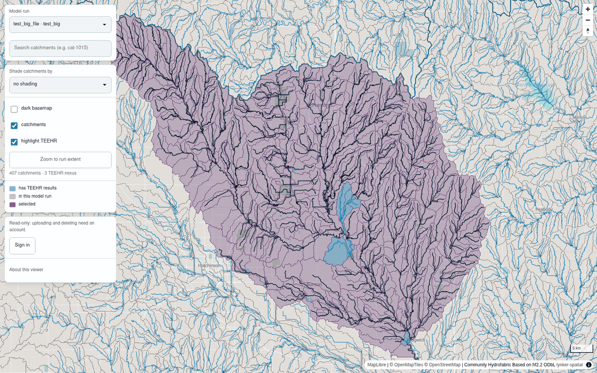
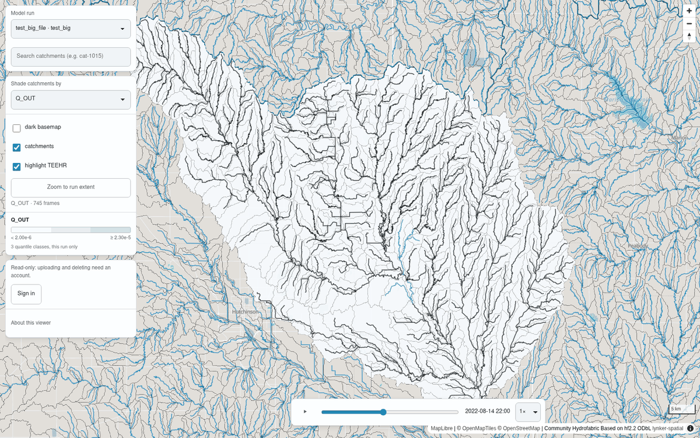
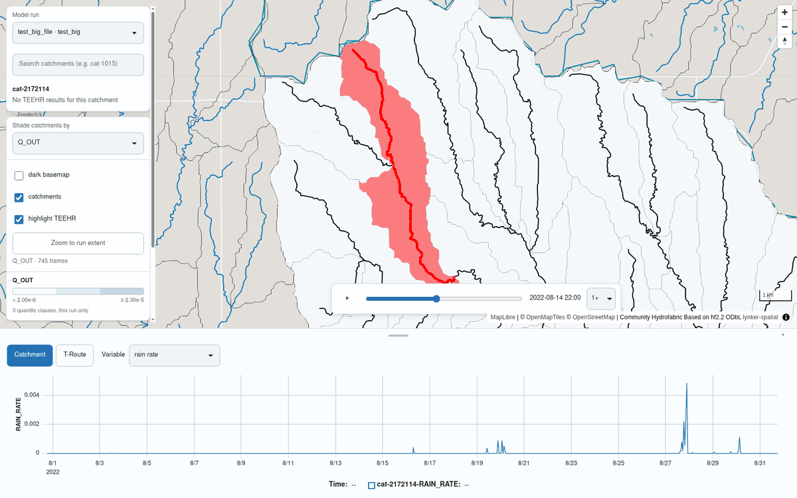
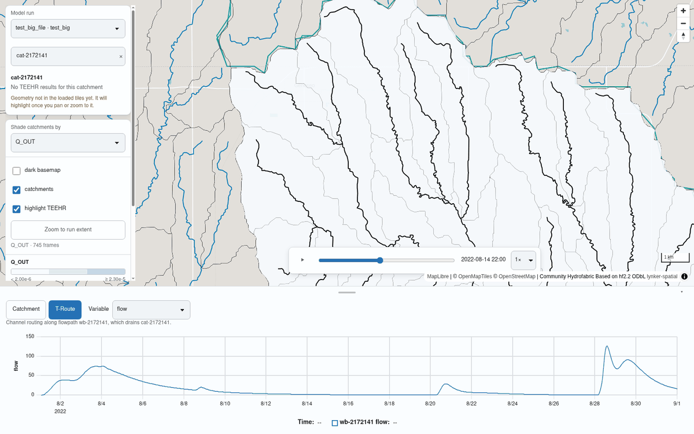
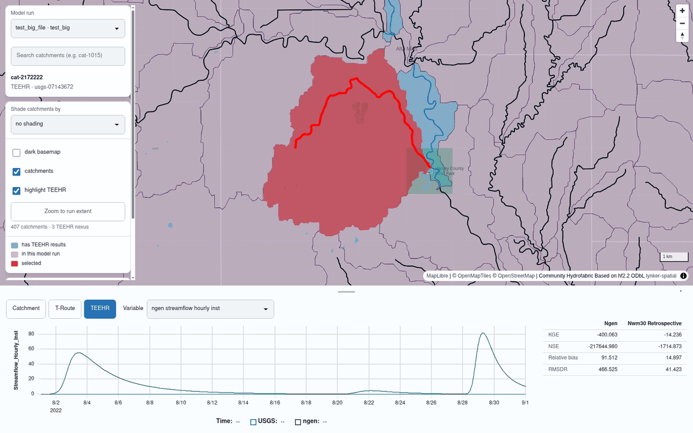

# NGIAB Output Visualizer

| | |
| --- | --- |
|  | Funding for this project was provided by the National Oceanic & Atmospheric Administration (NOAA), awarded to the Cooperative Institute for Research to Operations in Hydrology (CIROH) through the NOAA Cooperative Agreement with The University of Alabama (NA22NWS4320003). |

A map and chart view over the outputs of a NextGen In A Box run. Pick a run, click a
catchment, compare its hydrograph against observations. It is a Tethys app: vanilla JS and
web components on the front, Django on the back, no bundler and no build step.

Built on Tethys Platform [(Swain et al., 2015)](https://doi.org/10.1016/j.envsoft.2015.01.014).



## Run it

**With the launcher.** `viewOnTethys.sh` lives here and in
[NGIAB-CloudInfra](https://github.com/CIROH-UA/NGIAB-CloudInfra); `guide.sh` calls it after a
run finishes. It picks a port, imports a run directory, and starts the container.

```bash
./viewOnTethys.sh              # import a run, then launch
./viewOnTethys.sh -n           # launch with what is already there
./viewOnTethys.sh -p           # rootless Podman instead of Docker
./viewOnTethys.sh -h           # every flag
```

Runs land in `~/ngiab_visualizer`. If a name is already there it asks whether to overwrite or
keep both, so several runs on the same hydrofabric can sit side by side.

**Docker directly.**

```bash
docker run --rm -d -p 8080:8080 \
  -v "$HOME/ngiab_visualizer:/home/tethys/persist/ngiab_visualizer" \
  --name tethys-ngen-portal awiciroh/tethys-ngiab:latest
```

**Apptainer,** for a cluster with no daemon and no root:

```bash
apptainer pull ngiab.sif oras://ghcr.io/ciroh-ua/ngiab-client/apptainer:latest
apptainer run ngiab.sif
```

Writable state goes to `~/.ngiab_visualizer`; set `NGIAB_STATE_DIR` to move it to scratch and
`APPTAINERENV_PORT` to move the port. `apptainer run-help ngiab.sif` has the rest.

Then open <http://localhost:8080/>. Viewing needs no sign-in. Uploading or deleting a run
does: the image bakes `admin` / `pass`, which is fine locally and must be rebuilt for
anything shared.

## The run directory

**The directory is the registry.** A run is registered by being under the storage root, one
directory per run. Nothing else records it, so removing the directory removes the run.

```
~/ngiab_visualizer/
└── gage-10154200/
    ├── manifest.json                  written on ingest; a run without one is not usable
    ├── config/
    │   └── *.gpkg                      hydrofabric: divides, nexus, flowpaths
    └── outputs/
        ├── ngen/                       per-catchment series, .csv or .parquet
        │   ├── cat-2863848.csv
        │   └── nex-2863779_output.csv
        └── troute/                     channel routing, .nc or .parquet
            └── troute_output_*.nc
```

`teehr/` beside those is optional; when present its evaluation is read for the run that
carries it.

`manifest.json` is what makes a run usable. Uploading writes it. For a directory you copied
in yourself, write it once:

```bash
docker exec tethys-ngen-portal \
  tethys manage write_manifest --path /home/tethys/persist/ngiab_visualizer/<name>
```

A run with no manifest still appears in the picker, marked unusable and naming that command.
Upgrading from a version that used `ngiab_visualizer.json`, the command reads that file and
keeps the run's name and its old id, so links shared as `?model_run_id=<uuid>` still resolve.

## What it does

Catchments can be shaded by any output variable. Picking one classifies every catchment into
quantile classes and reveals a timeline that steps or plays through the run.



Clicking a catchment, or searching one by id, loads its time series.



**T-Route** switches the same chart to the flowpath that catchment drains into.



Catchments with a TEEHR evaluation are highlighted on the map, and their id carries a TEEHR
badge in the search results. Selecting one adds a **TEEHR** source that plots the simulated
series against the observed gauge, with the evaluation metrics in a table beside it.



## Uploading a run

Sign in, then use **Upload a run** under the run picker. It takes a `.tar`, `.tar.gz` or
`.zip` of the run directory, up to 5 GB.

**Compress before you upload.** The archive is the whole run directory, and a NextGen run is
mostly text: `.csv` outputs and per-catchment configs compress by a large factor. Use
`.tar.gz` rather than `.tar` — the upload is the slow part, and gzip is the cheapest way to
make it shorter.

```bash
tar -czf gage-10154200.tar.gz -C ~/ngiab_visualizer gage-10154200
```

**On S3, convert the outputs first.** t-route writes netCDF, and netCDF cannot be read over
`s3://` — the map loads and every routing chart fails. Convert to parquet before uploading:

```bash
docker exec tethys-ngen-portal \
  tethys manage convert_outputs --path /home/tethys/persist/ngiab_visualizer/<name>
```

On the filesystem backend this is optional; parquet is still faster to read.

Where the upload goes depends on the backend. On the filesystem it posts to the portal. On
S3 the browser gets a presigned URL and PUTs straight to the bucket, so the archive never
passes through the portal — which is what makes a 5 GB upload practical. That needs CORS on
the bucket allowing `PUT` from the portal's origin.

## Hosted deployments

Set `NGIAB_STORAGE_BACKEND=s3` and runs are addressed as objects instead of files, read with
DuckDB over `httpfs`. If Django's `STORAGES` has no `ngiab_runs` entry the run store borrows
the portal's `default` storage — the bucket already holding media — under a prefix.

| Variable | Default | What it does |
| --- | --- | --- |
| `NGIAB_STORAGE_BACKEND` | `local` | `s3` addresses runs as objects. |
| `NGIAB_MANAGED_ROOT` | `$TETHYS_PERSIST/ngiab_visualizer` | Where runs live on the filesystem backend. |
| `NGIAB_RUNS_PREFIX` | `ngiab_visualizer` | Prefix when borrowing the portal's media bucket. |
| `NGIAB_S3_BUCKET` | — | Bucket for the container's own `STORAGES` hook. |
| `NGIAB_S3_ENDPOINT` | — | Custom endpoint (MinIO). Omit for AWS. |
| `NGIAB_S3_PUBLIC_ENDPOINT` | — | Endpoint used when signing upload URLs, when the browser cannot resolve the server's. |
| `NGIAB_LISTING_TTL_SECONDS` | `10` | How stale the run listing may be. |
| `NGIAB_MAX_CONCURRENT_INGESTS` | `2` | Uploads prepared at once per worker. Beyond it, 503. |

This image is a local tool. It bakes a known superuser and secret key and nothing at startup
refuses them, so do not host it — install the app into a portal image instead, which brings
its own.

### Installing into a portal image

A portal installs this like any other app, plus two things it will not do on its own: the
DuckDB extensions, and the `INSTALLED_APPS` entry.

```dockerfile
COPY apps/ngiab-client ${TETHYS_HOME}/apps/ngiab-client
RUN cd ${TETHYS_HOME}/apps/ngiab-client && uv pip install .

ENV DUCKDB_HOME=/opt/duckdb_extensions
RUN mkdir -p "${DUCKDB_HOME}" && "${VIRTUAL_ENV}/bin/python" -c "\
import duckdb, os; \
h = os.environ['DUCKDB_HOME']; \
c = duckdb.connect(); \
c.execute(f\"SET home_directory='{h}'\"); \
c.execute(f\"SET extension_directory='{h}'\"); \
[c.execute(f'INSTALL {e}') for e in ('httpfs', 'aws')]" \
    && chmod -R a+rX "${DUCKDB_HOME}"
```

Then in the portal's `portal_config.yml`:

```yaml
settings:
  INSTALLED_APPS:
    - tethysapp.ngiab
```

Tethys's app discovery loads apps for routing only. This one ships management commands, and
`ingest_archive` runs `convert_outputs` in a subprocess, so Django has to see it as an
application or an upload fails at the conversion step with `Unknown command`.

It needs `django-storages` and `numpy` 1.26 or newer from the portal, which a portal serving
media from S3 already has. It declares `duckdb` itself.

## Development

```bash
pdm install -G:all        # python deps
pdm run test              # pytest
pdm run lint              # flake8
pdm run format            # yapf
npm install && npm test   # frontend, real Chromium via @web/test-runner
```

The frontend is hand-authored vanilla JS under `tethysapp/ngiab/public/frontend/` and is
served as-is — no bundler, no build step, so an edit is live on reload. Its dependencies load
from a CDN at pinned versions, declared in the import map in
`tethysapp/ngiab/templates/ngiab/index.html`. See that directory's README.

Tests run inside the image rather than a local environment, because the base image installs
tethys-platform from git main and a locally built environment is a different Tethys than the
one that ships:

```bash
docker build --target test -t ngiab-visualizer:test .
docker run --rm ngiab-visualizer:test
```

## Acknowledgements

Funded by CIROH through the NOAA Cooperative Agreement with The University of Alabama
(NA22NWS4320003).

## Contribute

Issues and pull requests: <https://github.com/CIROH-UA/ngiab-client>.
