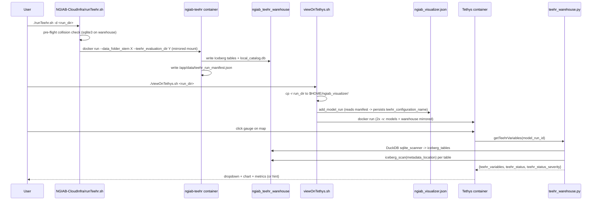

# feat: TEEHR warehouse compatibility for new ngiab-teehr output

**Target repos:** `ngiab-client` (primary), `ngen/NGIAB-CloudInfra`, `ngen/ngiab-teehr`

## Overview

`ngiab-teehr` PR #8 replaces the per-model-run TEEHR output (`<run>/teehr/metrics.csv` + parquet files) with a shared Iceberg warehouse written through a SQLite JDBC catalog. The NGIAB visualizer currently reads the old layout and is fully broken against the new one. This plan updates the three repos to make the visualizer work against the new warehouse, via a DuckDB-only reader (no new Python dep), a cross-repo manifest hand-off for run↔configuration mapping, and minimal UI scaffolding for future cross-run comparison.

All six architectural decisions (OD1-OD6) were resolved during brainstorming (see origin: `docs/brainstorms/2026-04-20-teehr-warehouse-compatibility-requirements.md`).

## Problem Frame

The new warehouse is structured as:
- `<warehouse>/local/local_catalog.db` -- SQLite-backed Apache Iceberg JDBC catalog. Metadata pointers only (`iceberg_tables` with `metadata_location`); no table data.
- `<warehouse>/local/teehr/<table>/{data,metadata}/` -- Iceberg-format parquet tables. All three surfaces (the `.db`, `metadata/*.json`, and `metadata/*.avro`) embed absolute host paths.
- `<warehouse>/local/version` -- TEEHR semver (e.g. `0.6.0`).

The visualizer must read this layout without breaking existing single-run UX, while introducing minimal scaffolding for an anticipated cross-run-comparison follow-up (see origin: OD3).

## Requirements Trace

| ID | Requirement | Source |
|---|---|---|
| R1 | Running `ngiab-teehr` post-PR #8 against a run produces a dropdown, chart, and metrics panel that behave like today | origin FR4, Success Criteria |
| R2 | Empty states (no warehouse, no run eval, legacy format, version mismatch, unreachable paths, missing crosswalk, missing metrics) each show a specific user-facing `teehr_status` + severity; no stack traces | origin FR6 |
| R3 | Warehouse is reached via a shared second bind-mount mirrored on the same absolute host path; Linux/WSL2 only | origin FR1 |
| R4 | Run↔configuration mapping is persisted at registration via a manifest written by the teehr container; fallback derivation for pre-manifest runs | origin FR2, FR7 |
| R5 | `runTeehr.sh` performs a pre-flight collision check and warns the user before overwriting another run's configuration | origin OD6 |
| R6 | The client does not gain the TEEHR Python SDK as a dependency; DuckDB + `sqlite_scanner` + `iceberg_scan` instead | origin OD1 |
| R7 | `get_joined_timeseries` re-implements teehr's join; drift is guarded by an integration test that recomputes metrics from our join and asserts equality with `ngen_metrics` | origin OD2 |
| R8 | Visualizer JSON registry gains `teehr_configuration_name` only (no per-run warehouse override) | origin OD5 |
| R9 | TEEHR dropdown groups entries under "This run" (with a placeholder "Other runs" heading) and labels each entry with its source run, as scaffolding for the cross-run follow-up | origin OD3 |
| R10 | Hard cutover: no legacy reader; old-layout detection surfaces an informational hint only | origin OD4 |

## Scope Boundaries

- **Not full cross-run comparison UI** -- only scaffolding (grouping, labels). Multi-select chart + N-series + per-configuration metrics are deferred.
- **Not dual-reader for legacy output** -- `<run>/teehr/metrics.csv` triggers a hint, never a chart.
- **Not Docker Desktop on Windows/macOS host-path-translation** -- Linux/WSL2 only in this release.
- **Not Singularity support** for the second mount -- follow-up.
- **Not client-side warehouse writes** -- read-only code path; future annotation/bookmark features will use a separate store.
- **DuckDB version bump REQUIRED**: 1.1.3 -> 1.5.x. Verified via spike (see §Verified) that DuckDB 1.1.3's iceberg extension cannot read `configurations`, `location_crosswalks`, or `locations` tables written by teehr 0.6.2 (fails with `Invalid field found while parsing field: type`). DuckDB 1.5.2 reads all tables cleanly. The earlier "no bump" scope boundary is inverted.
- **No pytest-in-CI rollout** -- the new drift-mitigation integration test is locally-triggered; adding Docker-in-CI is out of scope.

### Deferred to Separate Tasks

- **Full cross-run comparison UI**: separate GitHub issue in `ngiab-client` with acceptance criteria (multi-select in `teehrSelect`, N-series chart handling, per-config metrics rows, backend filter relaxation).
- **Singularity second-mount parity**: separate issue in `ngiab-client`, tied to the `singularity/` and `singularity_tethys_ngiab.def` assets.
- **Windows Docker Desktop path-rewriting**: separate issue, scoped to mirror teehr's own `import_evaluation.py` path-rewrite utility.
- **Docker-in-CI for the drift integration test**: separate workflow in `.github/workflows/` once the broader CI-runs-pytest conversation happens.

## Context & Research

### Relevant Code and Patterns

**ngiab-client (primary):**
- `tethysapp/ngiab/utils.py` -- current DuckDB patterns are ad-hoc `duckdb.query(...)` or `duckdb.connect(":memory:")`; no connection pooling; no extensions loaded. The new reader will extend this idiom but open catalog connections read-only with explicit `INSTALL sqlite; LOAD sqlite; INSTALL iceberg; LOAD iceberg;`.
- `tethysapp/ngiab/controllers.py` -- `@controller` decorator pattern; endpoints return `JsonResponse`.
- `tethysapp/ngiab/tests/tests.py` -- uses `TethysTestCase` from `tethys_sdk.testing`.
- `reactapp/features/hydroFabric/store/reducers/hydroFabricReducer.js` (lines 52-66, 543) -- `teehr` slice + `reset_teehr` case; uses `useReducer` + Context, **not Redux**.
- `reactapp/features/hydroFabric/store/actions/actionsTypes.js` (lines 37-47) -- flat SCREAMING_SNAKE_CASE constants; unused typo `set_reset_teehr` at line 44 (cleanup opportunity).
- `reactapp/features/hydroFabric/hooks/useHydroFabric.js` -- the dispatch-wrapper pattern to extend.
- `reactapp/features/hydroFabric/components/teehrSelect.js` -- current conditional render pattern (gates label+dropdown on `state.teehr.id`); must change so hint region renders outside the gate.
- `reactapp/features/hydroFabric/components/selectComponent.js` (lines 7-27, 50-72) -- react-select with a **virtualized `MenuList` built on `react-window`** that assumes flat children. Grouped options will require either a non-virtualized variant for this widget or handling groups in the MenuList.

**NGIAB-CloudInfra:**
- `runTeehr.sh` (v1.4.1, 370 lines) -- `getopts 'd:hrt:y'`, default-to-yes prompts, `trap handle_sigint INT`, config file at `$HOME/.host_data_path.conf`. Currently passes NO args to the container; must be updated to match ngiab-teehr's newer `runTeehr.sh` interface.
- `viewOnTethys.sh` -- single `-v` mount today at `MODELS_RUNS_DIRECTORY:TETHYS_PERSIST_PATH/ngiab_visualizer`; `add_model_run` uses a jq pipeline to append to `ngiab_visualizer.json`.

**ngiab-teehr (branch `7-update-to-latest-teehr-version`):**
- `scripts/teehr_ngen.py` -- already computes `ngen_configuration_name = "ngen_" + sanitized_stem` (line 66); `Dockerfile` entrypoint `["/entrypoint.sh", "python", "teehr_ngen.py"]`; runs as `--user $(id -u):$(id -g)` so writes to `/app/data` are host-user-owned.
- `runTeehr.sh` (v1.4.2) -- the newer reference implementation; passes `--data_folder_stem` and `--teehr_evaluation_dir` with mirrored-path mount. NGIAB-CloudInfra's script should converge with this.
- `requirements.txt` -- already pins `pyiceberg==0.10.0` (producer-side only, not needed in client).

### Institutional Learnings

None. `docs/solutions/` does not exist in any of the three repos. Recommend seeding via `ce-compound` after this ships.

### External References

- DuckDB Iceberg extension (current stable): `https://duckdb.org/docs/current/core_extensions/iceberg/overview.html` -- documents `iceberg_scan(metadata_path, allow_moved_paths=true)`, `iceberg_metadata`, `iceberg_snapshots`. The extension is not labelled experimental in official DuckDB docs (the "experimental" disclaimer on the `duckdb_iceberg` GitHub repo README is considered stale for the purposes of this plan; see origin doc).
- TEEHR source (referenced in design):
  - `teehr/const.py` -- `LOCAL_CATALOG_DB_NAME = "local_catalog.db"`, `LOCAL_CATALOG_TYPE = "jdbc"`
  - `teehr/evaluation/spark_session_utils.py:519-523` -- Iceberg SparkCatalog + `jdbc.driver=org.sqlite.JDBC`
  - `teehr/evaluation/evaluation.py:787-789` -- writes `<warehouse>/local/version` with `teehr.__version__`
  - `teehr/evaluation/views/joined_timeseries_view.py:146-209` -- the Spark join we are re-implementing in DuckDB; our SQL will reference this version string in comments
  - `teehr/utilities/import_evaluation.py:87-171` -- the precedent for path-rewriting the three places absolute paths are embedded (catalog, `.json`, `.avro`) if we ever need to relax mirror-path constraints

## Key Technical Decisions

| Decision | Rationale |
|---|---|
| DuckDB `sqlite_scanner` + `iceberg_scan(metadata_location)` per table | No new Python dep; fits existing DuckDB idioms in `utils.py`. See origin: OD1. |
| Re-implement `joined_timeseries` join in DuckDB with integration-test drift guard | Avoids pulling in the TEEHR SDK (PySpark + JVM) for one view. See origin: OD2. |
| Shared warehouse, mirrored-path bind-mount, Linux/WSL2 only | Absolute paths are embedded inside `local_catalog.db` + `.json` + `.avro`; mirroring is the minimum viable fix. See origin: FR1. |
| Manifest-based run↔configuration mapping; fallback sanitizes basename | Survives `viewOnTethys.sh` "Duplicate"-rename; fallback keeps legacy registered-but-not-yet-evaluated runs usable. See origin: FR2. |
| Pre-flight collision detection in `runTeehr.sh` with confirm + `-f` force flag | Catches the common "same basename twice" case before teehr appends data. See origin: OD6. |
| Manifest emission owned by `ngiab-teehr` (producer); consumed by `viewOnTethys.sh` | Producer is the authoritative source of the exact configuration name it wrote. |
| `useReducer`+Context (not Redux) for the new `teehr.status` field | Matches existing hydroFabric feature pattern. |
| Drift-mitigation integration test is local-only | CI does not run pytest today; Docker-in-CI is a bigger scope. Test is runnable on developer laptops and required before bumping the pinned `awiciroh/ngiab-teehr` tag. |
| Hard cutover; no legacy reader | User direction during brainstorm. |

## Open Questions

### Resolved During Planning

- **Which catalog tables must the reader open?** -- At minimum: `configurations`, `locations`, `location_crosswalks`, `primary_timeseries`, `secondary_timeseries`, `ngen_metrics`. `variables` is needed only if we mirror teehr's variable-name parse (we do -- see Unit 2 technical design).
- **Where do we put the drift-mitigation test?** -- `tests/test_teehr_warehouse_drift.py` under the repo-root `tests/` dir (matches `pyproject.toml:40` `testpaths = ["tests"]`); skipped if Docker isn't available via a `docker` pytest marker.
- **How does the React component know about the new `teehr_status` + `teehr_status_severity`?** -- Backend returns them on `getTeehrVariables` response; a new `set_teehr_status` action dispatches to a new `teehr.status` sub-slice; `teehrSelect` reads `state.teehr.status.{message,severity}` and renders a hint region.
- **How does `teehrSelect` handle grouped options against the virtualized `MenuList`?** -- Use `react-select`'s native grouped-options shape `[{label, options:[...]}]` and render with the default non-virtualized `MenuList` for the TEEHR dropdown specifically (the option count for a single run is small; virtualization is not needed there). The rest of the app keeps its virtualized variant.
- **What does the `teehr_run_manifest.json` schema look like?** -- See Unit 1 technical design below.

### Deferred to Implementation

- Exact DuckDB SQL for the joined-timeseries re-implementation -- the shape is specified in Unit 2 technical design, but final SQL will be iterated against the integration test.
- Whether the backend should cache `metadata_location` results within a single request (performance) or always re-read (staleness safety) -- start with always-re-read; optimize later if profiling shows a hit.
- Exact message wording for each of the nine `teehr_status` strings -- the FR6 table in the origin doc is directionally right; final copy may shift during review.

## High-Level Technical Design

> *These illustrate the intended flow and are directional guidance for review, not implementation specification. The implementing agent should treat them as context, not code to reproduce.*

### Cross-repo data hand-off



### `teehr_warehouse.py` reader flow (intended shape, not code)

```
open_catalog(warehouse_path) -> conn
    attach local/local_catalog.db read-only via sqlite_scanner
    install+load iceberg extension
    verify local/version is within supported teehr range

for each table needed:
    metadata_location = SELECT metadata_location FROM iceberg_tables
                        WHERE table_namespace = 'local' AND table_name = ?
    register a DuckDB view via iceberg_scan(metadata_location)

list_configurations_for_run(cfg_name):
    SELECT distinct (configuration_name, variable_name)
    FROM secondary_timeseries
    WHERE configuration_name IN (cfg_name, 'nwm30_retrospective')

get_joined_timeseries(cfg_name, var_name, usgs_loc):
    -- mirrors teehr/evaluation/views/joined_timeseries_view.py:146-209
    JOIN primary_timeseries p ON p.location_id = usgs_loc
    JOIN location_crosswalks x ON x.primary_location_id = p.location_id
    JOIN secondary_timeseries s
      ON s.location_id = x.secondary_location_id
     AND s.value_time = p.value_time
     AND s.variable_name = p.variable_name
     AND s.configuration_name = cfg_name

get_metrics_for_location(cfg_name, usgs_loc):
    SELECT metric_name, configuration_name, value
    FROM ngen_metrics
    WHERE primary_location_id = usgs_loc
      AND configuration_name IN (cfg_name, 'nwm30_retrospective')
    (pivot to row-per-metric in pandas; match the shape utils.py L500 produces today)
```

### `teehr_run_manifest.json` schema (emitted by ngiab-teehr)

```
{
  "manifest_version": 1,
  "teehr_configuration_name": "ngen_awi_16_2863657_007",
  "teehr_evaluation_dir": "/home/user/ngiab_teehr_warehouse",
  "teehr_image_tag": "awiciroh/ngiab-teehr:<tag>",
  "teehr_package_version": "0.6.0",
  "data_folder_path": "/home/user/ngen-data/AWI_16_2863657_007",
  "produced_at": "2026-04-20T14:22:31Z"
}
```

## Implementation Units

Grouped into phases for sequencing clarity. Unit numbering is global.

### Phase A -- Producer (`ngiab-teehr`)

- [ ] **Unit 1: Emit `teehr_run_manifest.json` from the teehr container**

> **Deferred (2026-04-24).** Producer-side changes cannot land in `ngiab-teehr` at this time. Client-side derivation of `teehr_configuration_name` from the run folder basename now serves as the primary path; the manifest reader in `viewOnTethys.sh` (Unit 7) remains in place and will still take precedence if the producer ever lands this change. See `docs/plans/2026-04-24-001-feat-teehr-config-name-client-derivation-plan.md`.

**Goal:** On successful completion of `scripts/teehr_ngen.py`, write a manifest file into `/app/data/` so that `viewOnTethys.sh` can read it at registration time.

**Requirements:** R4, R5

**Dependencies:** None

**Target repo:** `ngen/ngiab-teehr` (branch `7-update-to-latest-teehr-version`)

**Files:**
- Modify: `scripts/teehr_ngen.py`
- Test: `scripts/tests/test_manifest.py` *(new; only if the repo has a pytest setup; otherwise verify via the drift integration test in Unit 3)*

**Approach:**
- In `main()`, after the final `.write(...)` for `NGEN_METRICS_TABLE_NAME`, serialize a manifest dict to `NGEN_OUTPUT_DIR / "teehr_run_manifest.json"`. Use stdlib `json` only.
- Include the fields in the schema above. `produced_at` is UTC ISO-8601 from `datetime.utcnow().isoformat() + "Z"`. `teehr_image_tag` and `teehr_package_version` come from env vars set by the `runTeehr.sh` invocation (`TEEHR_IMAGE_TAG`, `teehr.__version__`). `data_folder_path` is also passed through an env var set by `runTeehr.sh` so the sanitized stem and the raw host path are both captured.
- Write atomically: write to `.tmp` then `os.replace`.

**Technical design:** *(directional)* Add a new helper `write_run_manifest(ngen_output_dir, ngen_configuration_name, teehr_evaluation_dir, data_folder_path)` alongside the existing utilities so it is unit-testable without invoking `main()`.

**Patterns to follow:** Mirror the stdlib-only style in `scripts/teehr_ngen.py`; keep the writer pure.

**Test scenarios:**
- Happy path: `write_run_manifest(...)` produces a well-formed JSON with all required fields, valid ISO-8601 timestamp, and matches the documented schema.
- Edge case: an existing `teehr_run_manifest.json` is overwritten atomically (no partial file left).
- Error path: a non-writable `ngen_output_dir` raises an explicit `OSError` (not silent failure), since `viewOnTethys.sh`'s fallback path depends on the manifest's absence meaning "no manifest" rather than "tried and failed."

**Verification:**
- After a successful container run, `teehr_run_manifest.json` exists in the host model-run directory with `manifest_version: 1`.
- The sanitized configuration name in the manifest equals the string written into the warehouse's `configurations` table.

---

### Phase B -- Visualizer backend reader (`ngiab-client`)

- [ ] **Unit 2: New module `tethysapp/ngiab/teehr_warehouse.py`**

**Goal:** DuckDB-based reader that opens the warehouse, reads Iceberg tables via `sqlite_scanner` + `iceberg_scan`, and exposes the six operations listed in origin FR3 plus `configuration_exists` (used by Unit 4's fallback validation). Specifically: `list_configurations_for_run`, `get_joined_timeseries`, `get_metrics_for_location`, `usgs_for_ngen`, `list_usgs_locations_for_run`, and `configuration_exists`.

**Requirements:** R1, R2, R6, R7

**Dependencies:** None (but Unit 3's integration test is written in parallel to guard Unit 2's correctness -- see Execution note below)

**Files:**
- Create: `tethysapp/ngiab/teehr_warehouse.py`
- Test: `tests/test_teehr_warehouse.py` *(new; unit tests using small fixture warehouse)*
- Modify: `pyproject.toml` -- bump `duckdb` pin from 1.1.3 to `>=1.5,<1.6`; add `pytz` as an explicit dep (required by DuckDB 1.5 when decoding tz-aware timestamp columns on `ngen_metrics`)
- Modify: `pdm.lock` -- regenerate after pyproject change (`pdm lock`)
- Modify: `Dockerfile` -- new `RUN` line pre-installing the DuckDB `sqlite` and `iceberg` extensions at image build so runtime `LOAD` does not need network egress
- Regression-test: all existing DuckDB call sites in `tethysapp/ngiab/utils.py` (lines 97, 130, 331, 402, 426) after the bump -- DuckDB 1.5 is a major-feature jump from 1.1.3 and some SQL idioms may behave differently

**Approach:**
- Single class `WarehouseReader(warehouse_path)` with explicit `close()` (or use as a context manager). No module-level singleton -- a new reader per top-level controller call, keyed on `warehouse_path`, so path changes across requests don't cause stale state (origin risk: warehouse A/B switch).
- On `__init__`: verify `local/version` against a module-level constant `SUPPORTED_TEEHR_VERSIONS = SpecifierSet(">=0.6.0,<0.7.0")` (single specifier string, using `packaging.specifiers.SpecifierSet`). Unsupported -> raise typed exception `UnsupportedWarehouseVersion`.
- Open DuckDB `:memory:` connection with `read_only=True` access for the SQLite attach. At image build time, pre-install the extensions via a new `RUN` line in `Dockerfile` (`python -c "import duckdb; c=duckdb.connect(); c.execute('INSTALL sqlite; INSTALL iceberg;')"`) so `LOAD sqlite; LOAD iceberg;` at runtime does NOT require network egress; the runtime code only does `LOAD`.
- **SQLite WAL-mode catalog handling:** the JDBC catalog may be in WAL mode after the teehr writer exits (WAL sidecars present). A READ_ONLY attach may fail; the producer is expected to cleanly exit with the journal checkpointed. If that assumption fails, map DuckDB's "catalog locked" / "attach failed" error to a new `WarehouseCatalogLocked` exception and surface as status `TEEHR warehouse is busy or improperly closed. Wait and refresh, or rerun TEEHR.` (severity: warning).
- `ATTACH '<warehouse>/local/local_catalog.db' AS cat (TYPE sqlite, READ_ONLY)`.
- Read `cat.iceberg_tables` **once per top-level public method call** and cache the `(table_name -> metadata_location)` mapping for the duration of that call. All table registrations within a single method call MUST use that frozen snapshot so that joins observe Iceberg-snapshot isolation across tables. Cross-request reads happen from scratch to pick up new snapshots from concurrent teehr runs. Do NOT pass `allow_moved_paths=true` -- in DuckDB 1.1.3 that flag is only accepted when the path is a table root, not a direct `.metadata.json` file (verified: `InvalidInputException`). If mount-mirroring is violated, `iceberg_scan` raises with a path-not-found error which the reader maps to `WarehouseMountMirrorBroken`.
- All SQL uses `?` parameter binding, not f-string interpolation (fix the injection-adjacent pattern from `utils.py`).

**Execution note:** Characterization-first for the join. Write Unit 3's drift integration test **before** finalizing `get_joined_timeseries`'s SQL -- the test is the oracle for what "correct" means. Once Unit 3 passes, the join is locked.

**Technical design:** See §High-Level Technical Design above. Key callouts: `allow_moved_paths=true` on every `iceberg_scan` call (cheap safety net against path shifts); typed exceptions `WarehouseUnreachable`, `ConfigurationNotFound`, `UnsupportedWarehouseVersion`, `WarehouseMountMirrorBroken` that controllers map to `teehr_status` strings.

**Patterns to follow:**
- `tethysapp/ngiab/utils.py:402-421` for the `conn.execute(...).fetchdf()` idiom (extend with parameterization).
- Controller-facing return shapes should match current `utils.py:467-519` pivot-to-row structure.

**Test scenarios:**
- Happy path: `list_configurations_for_run("ngen_test")` returns both `("ngen_test", "streamflow_hourly_inst")` and `("nwm30_retrospective", "streamflow_hourly_inst")`.
- Happy path: `get_metrics_for_location("ngen_test", "usgs-12345")` returns the expected pivoted shape with the 4 metrics (KGE, NSE, RBias, RMSDR).
- Edge case: warehouse `local/version` missing -> `UnsupportedWarehouseVersion` raised with a clear message.
- Edge case: `local/version` contains `0.7.0` -> `UnsupportedWarehouseVersion` (out of range).
- Edge case: `configurations` table is empty -> `list_configurations_for_run` returns `[]`.
- Error path: `local_catalog.db` exists but `metadata_location` points at a path that doesn't exist inside the container (mirror-mount violation) -> `WarehouseMountMirrorBroken` raised; message names the missing path.
- Error path: USGS location id does not exist in `location_crosswalks` -> `usgs_for_ngen` returns `None`; `get_joined_timeseries` returns an empty series list (not an exception).
- Edge case: two readers opened against different warehouse paths in the same process get isolated DuckDB connections; closing one does not affect the other.
- Integration (covered by Unit 3): metrics recomputed from our DuckDB-side join equal the metrics stored in `ngen_metrics` within a tight tolerance for all four standard metrics.

**Verification:**
- `pytest tests/test_teehr_warehouse.py` green against a small fixture warehouse (checked in or generated on demand).
- Unit 3's integration test green.

---

- [ ] **Unit 3: Drift-mitigation integration test**

**Goal:** Prove that the DuckDB-side re-implementation of `joined_timeseries_view` produces metric values identical (within tolerance) to what TEEHR itself produces, so future teehr releases that drift the join semantics break CI-adjacent signals before they break users.

**Requirements:** R7

**Dependencies:** Unit 1 (manifest emission lets the test validate the full pipeline), Unit 2 skeleton (the reader class must exist; the SQL can be WIP)

**Files:**
- Create: `tests/test_teehr_warehouse_drift.py`
- Create: `tests/fixtures/teehr_drift/` (small NGEN fixture dataset; check in or document how to regenerate)
- Modify: `tests/conftest.py` *(new if absent)* -- register a `docker` pytest marker
- Modify: `README.md` -- add a "Bumping the pinned `awiciroh/ngiab-teehr` tag" section pointing at this test

**Approach:**
- Test runs the pinned `awiciroh/ngiab-teehr` image against a fixture model-run directory inside a `tmp_path` warehouse.
- Reads TEEHR-authoritative `ngen_metrics` via `WarehouseReader.get_metrics_for_location`.
- Reads the raw joined timeseries via `WarehouseReader.get_joined_timeseries` and recomputes KGE, NSE, Relative Bias, and RMSDR in pandas.
- Asserts that the two metric sets match within **empirically calibrated** tolerances. Do NOT ship a flat `1e-6` -- Spark and pandas summation order over large timeseries produces KGE/NSE drift in the `1e-5` to `1e-4` range routinely. Procedure: run the fixture once, measure the actual per-metric spread, set `rtol` and `atol` with ~10× safety margin, and commit the observed numbers as a comment next to the assertion (e.g., `# measured drift: KGE ~3.2e-5; tolerance set to 5e-4`). Start point: `rtol=1e-4, atol=1e-7` per metric; calibrate before landing.
- Guarded by `pytest.mark.docker`; skipped when Docker is unavailable; documented as a required manual step before a teehr tag bump.

**Execution note:** Test-first. Implement this test (and the fixture) before the final SQL for `get_joined_timeseries` is written.

**Test scenarios:**
- Happy path: full pipeline (teehr container runs -> reader computes join -> metrics match `ngen_metrics`).
- Edge case: when the fixture has gauges with no USGS observations, `get_joined_timeseries` returns empty for that location and the test does not crash.
- Integration: the same test, re-run after bumping the `awiciroh/ngiab-teehr` tag env var (manual workflow), either passes or fails with a clear diff so a maintainer knows the join needs updating.

**Verification:**
- Test passes locally with `pytest -m docker tests/test_teehr_warehouse_drift.py`.
- README documents the "run this before bumping the teehr tag" workflow.

---

- [ ] **Unit 4: Replace TEEHR readers in `tethysapp/ngiab/utils.py` and controllers**

**Goal:** Remove the legacy file-reading functions and wire controllers to the new `WarehouseReader`. Produce the new response shape.

**Requirements:** R1, R2, R4, R8, R10

**Dependencies:** Unit 2

**Files:**
- Modify: `tethysapp/ngiab/utils.py`
- Modify: `tethysapp/ngiab/controllers.py`
- Test: extend `tethysapp/ngiab/tests/tests.py` (controller-level assertions) and `tests/test_teehr_warehouse.py` (detection of legacy-layout)

**Approach:**
- Remove `get_base_teehr_path`, `append_ngen_usgs_column`, `get_usgs_from_ngen`, `get_usgs_from_ngen_id`, `get_configuration_variable_pairs`, `get_teehr_joined_ts_path`, `get_teehr_ts`, `get_teehr_metrics` (current `utils.py:80-142, 309-520`).
- Add: `_resolve_configuration_name(model_run_id)` -> reads `ngiab_visualizer.json`; returns `teehr_configuration_name` if present; else applies `re.sub(r"[^a-zA-Z0-9_]", "_", basename).lower()` to the run's `path` basename and validates via `WarehouseReader.configuration_exists(cfg)`.
- Add: `_detect_legacy_teehr_layout(model_run_id)` -- returns True if `<model_path>/teehr/metrics.csv` exists.
- Controllers call `_resolve_configuration_name` once per request; errors caught and mapped to `teehr_status`/`teehr_status_severity`.
- The `getTeehrVariables` JSON response shape becomes `{"teehr_variables": [...], "teehr_status": str|None, "teehr_status_severity": "info"|"warning"|"error"|None}`.
- `getTeehrTimeSeries` response shape remains `{"metrics": ..., "data": ..., "layout": ...}` but on failure toasts from the React side; backend-side response shape for failures is also `{"metrics": [], "data": [], "layout": {...}, "teehr_status": str, "teehr_status_severity": "error"}`.

**Patterns to follow:**
- Current `@controller` pattern in `controllers.py`.
- The pivot shape at `utils.py:500-519` (preserved in `get_metrics_for_location`).

**Test scenarios:**
- Happy path: `getTeehrVariables` with a registered run that has teehr data -> response has non-empty `teehr_variables`, `teehr_status: None`.
- Edge case: run registered but warehouse env unset -> `teehr_variables: []`, `teehr_status` = "TEEHR warehouse is not configured", severity `info`.
- Edge case: run has legacy `<run>/teehr/metrics.csv` + no warehouse data -> `teehr_variables: []`, status = legacy-output string, severity `warning`.
- Edge case: manifest field present in `ngiab_visualizer.json` with `teehr_configuration_name` from a different basename (the "Duplicate" rename case) -> reader uses the manifest-stored name, not the run dir basename; data is found.
- Error path: warehouse version file reports `0.7.0` -> status = unsupported-version string, severity `warning`, no stack trace.
- Error path: warehouse reachable but `metadata_location` path not accessible from container (mirror-mount violation) -> status = files-not-reachable, severity `error`.
- Edge case: clicked location has no USGS crosswalk row -> status = no-usgs-gauge string, severity `info`, empty timeseries.
- Edge case: configuration exists but `ngen_metrics` is empty for this location -> `getTeehrVariables` still populates variables; `getTeehrTimeSeries` returns empty series + status = metrics-not-yet-available.

**Verification:**
- `TethysTestCase`-based controller tests pass for all scenarios above.
- Manually open the visualizer against a warehouse written by the pinned teehr tag and confirm the chart renders.

---

### Phase C -- Frontend (`ngiab-client`)

- [ ] **Unit 5: Extend reducer + actions for `teehr.status`**

**Goal:** Add a `status: { message, severity }` slice under `state.teehr`, plus action type and dispatcher. Clean up the unused `set_reset_teehr` typo.

**Requirements:** R2, R9

**Dependencies:** Unit 4 (controller must be returning the new fields)

**Files:**
- Modify: `reactapp/features/hydroFabric/store/reducers/hydroFabricReducer.js`
- Modify: `reactapp/features/hydroFabric/store/actions/actionsTypes.js`
- Modify: `reactapp/features/hydroFabric/hooks/useHydroFabric.js`

**Approach:**
- `actionsTypes.js` -- add `set_teehr_status: 'set_teehr_status'`; **RENAME** `set_reset_teehr: 'SET_RESET_TEEHR'` to `reset_teehr: 'RESET_TEEHR'`. This is NOT a cleanup -- there are 5 live call sites currently dispatching an `undefined` value (mapgl.js:309, :343; useHydroFabric.js:85-86; nexusSelect.js:31; teehrSelect.js:30, :56), and the reducer case at `hydroFabricReducer.js:543` switches on the missing key. Deleting the typo would entrench the bug; renaming fixes it.
- `hydroFabricReducer.js` -- extend the `teehr` initial state with `status: { message: null, severity: null }`; add a reducer case; have `reset_teehr` clear it.
- `useHydroFabric.js` -- add a `set_teehr_status(payload)` dispatcher.

**Test scenarios:**
- Reducer happy path: dispatching `set_teehr_status` with a `{message, severity}` payload updates `state.teehr.status`.
- Reducer edge case: `reset_teehr` clears both message and severity back to null.
- Reducer edge case: dispatching `set_teehr_status` with `null` message resets to pristine state.

**Verification:**
- Jest reducer tests pass (if the codebase has them; otherwise rely on the controller-level + UI manual checks).

---

- [ ] **Unit 6: Update `teehrSelect.js` -- hint region + grouped dropdown**

**Goal:** Surface `teehr.status` as a visible hint (regardless of whether the dropdown has options), and group the entries under "This run" / placeholder "Other runs" so the pattern is ready for the cross-run follow-up.

**Requirements:** R2, R9

**Dependencies:** Unit 5

**Files:**
- Modify: `reactapp/features/hydroFabric/components/teehrSelect.js`
- Possibly modify: `reactapp/features/hydroFabric/components/selectComponent.js` -- only if needed to support grouped options; otherwise use a local variant

**Approach:**
- Restructure the JSX so that after a location is clicked (`state.teehr.id` set), the TEEHR section label AND `<TeehrStatusHint>` render regardless of whether `state.teehr.variable_list` is empty. Before any click, the entire TEEHR section stays hidden (unchanged from today). Update: this is an intentional two-state gate: (pre-click) hidden entirely; (post-click) label + hint always; (post-click + variable_list non-empty) also dropdown + chart.
- `<TeehrStatusHint>` reads `state.teehr.status.{message, severity}`; renders nothing when `message` is null; otherwise renders a one-line hint styled by severity with explicit tokens:
  - `info`: `color: var(--text-muted)`; no background chip.
  - `warning`: `color: var(--text-warning)` with a yellow left-border (2px). Must have contrast ratio ≥4.5 against both the light-mode `#f0f0f0` and dark-mode `#4f5b67` sidebars.
  - `error`: `color: var(--text-error)` with a red left-border (2px). Same contrast requirement.
  - All severities carry `role="status"` and `aria-live="polite"` (for info, warning) or `aria-live="assertive"` (for error) so screen readers announce the change.
- Transform the flat `state.teehr.variable_list` into a grouped shape: `[{label: "This run", options: [{value, label}, ...]}]`. **react-select 5.8 does not expose a group-level `isDisabled` property** -- an empty-options group with the library's default rendering may be filtered out entirely, so do NOT rely on an `{label: "Other runs", options: [], isDisabled: true}` group for scaffolding. The visible "Other runs" affordance (if wanted) should be implemented via `formatGroupLabel` on the "This run" group rendering a secondary line "Cross-run comparison coming soon," OR by rendering a single always-present disabled OPTION (option-level `isDisabled: true` IS a documented react-select feature) labeled "Other runs -- coming soon." Either is acceptable; see open question about whether to show this at all (Product-lens finding #3).
- Pass this grouped shape directly into react-select. For the TEEHR dropdown specifically, bypass the virtualized MenuList (small option count; virtualization unnecessary) by using the default `MenuList` -- add a `virtualize={false}` prop to `SelectComponent` (the cleanest scope: new prop, default true; other consumers unaffected) rather than maintaining a local copy.
- Error-path toast on `getTeehrTimeSeries` failure: mirror `trouteSelect.js:61`'s `toast.error(...)`, AND also dispatch `set_teehr_status` so the persistent hint appears beneath the dropdown.

**Technical design:** *(directional)* The backend-returned grouped shape is authoritative; the component does not re-group. This keeps the "when cross-run ships" change scoped to backend filter relaxation + optionally a multi-select prop.

**Test scenarios:**
- Happy path: dropdown renders with "This run" header and one or two entries; placeholder "Other runs" header renders as disabled.
- Empty state: warehouse not configured -> dropdown hidden, hint visible with `info` styling.
- Error state: `teehr.status.severity = "error"` -> hint visible with red styling.
- Interaction: selecting a variable fires `getTeehrTimeSeries`; on success the chart updates; on failure the hint updates AND a toast appears.

**Verification:**
- Manual browser test against a live backend and a warehouse with a sample run.
- Existing snapshot tests (if any) updated; new tests for the hint-region visibility not behind the `state.teehr.id` gate.

---

### Phase D -- Orchestration (`NGIAB-CloudInfra`)

- [ ] **Unit 7: `viewOnTethys.sh` -- mirrored warehouse mount + manifest ingestion**

> **Updated (2026-04-24).** The manifest is now one of two sources for `teehr_configuration_name`. When the manifest is absent, `viewOnTethys.sh` derives the value from the run folder basename (`ngen_` + ASCII-sanitized lowercase basename) using the same rule the TEEHR producer applies internally, and persists it through the same jq append block. The manifest still wins when present. See `docs/plans/2026-04-24-001-feat-teehr-config-name-client-derivation-plan.md` for rationale and test scenarios. Unit 1 (producer emission) is deferred until upstream adoption.

**Goal:** Mount the shared warehouse into the Tethys container on the mirrored path, expose it via env, and enrich `ngiab_visualizer.json` entries with `teehr_configuration_name` from the manifest.

**Requirements:** R3, R4, R8

**Dependencies:** Unit 1 (manifest emission)

**Target repo:** `ngen/NGIAB-CloudInfra`

**Files:**
- Modify: `viewOnTethys.sh`

**Approach:**
- Add a new env var `TEEHR_WAREHOUSE_PATH`; prompt for it (with `$HOME/.teehr_evaluation_path.conf` persistence) the same way `ngiab-teehr/runTeehr.sh:54, 220-245` does.
- Add a second `-v "$TEEHR_WAREHOUSE_PATH:$TEEHR_WAREHOUSE_PATH"` mirrored-path mount to the `docker run` at `viewOnTethys.sh:368`.
- Pass `--env TEEHR_WAREHOUSE_PATH=$TEEHR_WAREHOUSE_PATH` so the Django backend sees it.
- In `add_model_run` (currently `viewOnTethys.sh:541-619`), collapse the current two-pass jq (`del` then `+=`) into a **single jq invocation** that both removes the old entry (if any) and appends the new one, written to `.tmp` and atomically `mv`'d. This closes a race window where a reader can observe the registry mid-write. Read `$model_run_path/teehr_run_manifest.json` if present, parse out `teehr_configuration_name`, and inject it into the entry in the same jq invocation. Malformed JSON -> log a warning, continue without the field.

**Test scenarios:** (manual -- no bash test harness in the repo)
- Happy path: run with a manifest present -> registry entry has `teehr_configuration_name`.
- Happy path: run with no manifest -> entry is registered without the field; fallback path in Unit 4 handles it.
- Edge case: malformed manifest JSON -> warning printed, entry still created without the field.
- Edge case: `TEEHR_WAREHOUSE_PATH` not set -> warehouse mount is not added, Tethys container boots, backend returns the "warehouse not configured" status.

**Verification:**
- `jq '.model_runs[-1].teehr_configuration_name'` on `ngiab_visualizer.json` returns the expected string after a fresh run.
- `docker inspect <tethys-container> | jq '.[0].Mounts'` shows both mount entries.

---

- [ ] **Unit 8: Rewrite `NGIAB-CloudInfra/runTeehr.sh`**

**Goal:** Match the new ngiab-teehr container interface (the `--data_folder_stem` / `--teehr_evaluation_dir` + mirrored-mount flavor already implemented in `ngiab-teehr/runTeehr.sh` v1.4.2) and add the pre-flight collision check + `-f` force flag.

**Requirements:** R3, R4, R5

**Dependencies:** None (runs in parallel with the rest)

**Target repo:** `ngen/NGIAB-CloudInfra`

**Files:**
- Modify: `runTeehr.sh`

**Approach:**
- Port the v1.4.2 structure from `ngiab-teehr/runTeehr.sh`: dual config files (`$HOME/.host_data_path.conf` + `$HOME/.teehr_evaluation_path.conf`), the warehouse prompt, `--user $(id -u):$(id -g)` invocation, mirrored-path mount.
- **Extend `-y` semantics** (do NOT add a separate `-f`): the existing `-y` flag already means "skip all confirmation prompts." The collision-check prompt is a confirmation; `-y` suppresses it too. Keep the getopts string as in v1.4.2.
- Pre-flight collision check (best-effort; see known limitation below): before `docker run`, compute `SANITIZED_STEM = $(basename "$DATA_FOLDER_PATH" | sed -E 's/[^a-zA-Z0-9_]/_/g' | tr 'A-Z' 'a-z')` (bash/sed only). Then scan manifests already under `$HOME/ngiab_visualizer/*/teehr_run_manifest.json` for matching `teehr_configuration_name == "ngen_${SANITIZED_STEM}"`. If found AND the recorded `data_folder_path` differs from the current `DATA_FOLDER_PATH`, surface the **scientific consequence** in the prompt, not the technical fact: `"A previous run (<prior_path>) wrote the same configuration name. Continuing will MIX streamflow data from both runs in the warehouse, producing incorrect metrics. Options: (R)ename the folder and rerun, (D)elete the prior configuration from the warehouse, (C)ontinue with mixed data, (Q)uit."` The prompt is skipped under `-y`. The vestigial `sqlite3 ... iceberg_tables` query is dropped -- it returns a metadata-file path, not configuration names.
- **Known limitation (documented, not fixed in this release):** the manifest scan only catches collisions for runs that have already passed through `viewOnTethys.sh`. A collision between two model-run directories that have NEVER been registered (producer-ran-but-never-viewed) will not be detected. Addressing this would require reading the warehouse's `configurations` Iceberg table via a Python/DuckDB helper invocation from the bash script, which is substantial. Filed as a follow-up issue; documented in the README warning as a user-facing known gap.
- Wrap `[ -f "$TEEHR_EVALUATION_DIR/local/local_catalog.db" ]` and `command -v sqlite3` guards around any step that depends on them (the script uses `set -e` so hard failures would crash it). If either guard fails, skip the collision check with an explicit `WARNING: collision detection unavailable -- <reason>`.
- Pin the image tag via a single top-of-file constant (`IMAGE_TAG_DEFAULT="x.y.z"`); the `-t` flag continues to override.

**Test scenarios:** (manual)
- Happy path: first run for `AWI_16_2863657_007` -> no prompt; container runs; manifest written.
- Collision path: running a second time against a different directory but same basename -> warning prints the prior run's path; prompt for confirmation.
- Collision path + `-f`: same scenario with `-f` -> no prompt; proceeds.
- Edge case: `$TEEHR_EVALUATION_DIR` does not contain a warehouse yet -> skip collision check; continue normally.
- Edge case: `sqlite3` not installed on the host -> collision check skipped with a warning, not a hard error (avoid blocking users who don't have sqlite3 locally).

**Verification:**
- Fresh run produces `teehr_run_manifest.json` in the input directory and populates the warehouse.
- Collision prompt fires when expected.
- `-f` flag behaves as documented.

---

### Phase E -- Documentation (absorbed into owning units)

Each unit's PR owns its own README update rather than a catch-all doc unit:
- Unit 1 PR updates `ngiab-teehr/README.md` (manifest schema).
- Unit 3 PR updates `ngiab-client/README.md` (the "bump the pinned teehr tag" workflow + drift-test invocation).
- Unit 7 PR updates `NGIAB-CloudInfra/README.md` (`TEEHR_WAREHOUSE_PATH`, mirrored-mount, Linux/WSL2-only constraint).
- Unit 8 PR updates `NGIAB-CloudInfra/README.md` (new flags on `runTeehr.sh`, collision-check known-limitation warning).

All three READMEs link back to the origin requirements doc and this plan; do not duplicate content.

### Post-ship follow-ups (NOT plan units)

- Create GitHub issue: "Full cross-run TEEHR comparison UI" in `ngiab-client` (see Scope Boundaries / Deferred to Separate Tasks). Body references this plan + OD3; acceptance criteria: multi-select dropdown, N-series chart, per-configuration metrics rows, backend filter relaxation, integration tests.
- Create GitHub issue: "Warehouse-configurations read for collision detection in runTeehr.sh" addressing the known limitation in Unit 8.
- Consider `ce-compound` on `docs/solutions/` capturing: Iceberg-via-DuckDB pattern, mirrored-mount story, manifest hand-off pattern.

## System-Wide Impact

- **Interaction graph:**
  - New: producer (ngiab-teehr) -> manifest -> orchestrator (NGIAB-CloudInfra) -> registry -> backend (ngiab-client) -> warehouse. Five hops; every hop has graceful-degradation behavior.
  - Chart/metrics panel now depends on the shared warehouse existing and being readable, not on per-run files. Failures in this path must never stack-trace into the frontend.
- **Error propagation:** All `WarehouseReader` exceptions are caught at the controller boundary and mapped to `teehr_status` + `teehr_status_severity`. Nothing leaks.
- **State lifecycle risks:**
  - Concurrent writer + reader on the same `local_catalog.db` -- reader uses read-only mode, re-reads catalog per request; documented user guidance to not run teehr and the visualizer concurrently.
  - `viewOnTethys.sh`'s "Duplicate" rename path (`viewOnTethys.sh:518-531`) -- manifest-based mapping makes this safe; the renamed run's registry entry still points at the original `teehr_configuration_name`.
- **API surface parity:** The three response shape changes (`teehr_status`, `teehr_status_severity` on `getTeehrVariables` and the failure branch of `getTeehrTimeSeries`) are additive; frontend consumers that don't know about the fields ignore them. No URL changes.
- **Integration coverage:** Unit 3's drift test is the only thing that proves `get_joined_timeseries` matches teehr's join semantics. It is the contract test for any future teehr tag bump.
- **Unchanged invariants:** The model-runs registry schema keeps `id`, `path`, `date`, `label`; map/hydrofabric/troute code paths are untouched; the one-run-per-page React architecture is preserved.

## Risks & Dependencies

| Risk | Mitigation |
|---|---|
| TEEHR format changes in a patch release (migrations on open can evolve schema) | Pinned `awiciroh/ngiab-teehr` tag in `runTeehr.sh`; `<warehouse>/local/version` check; Unit 3 drift test is the gate on any bump |
| Joined-timeseries join semantics drift from teehr | Unit 3 fails fast; the SQL comments cite the teehr source version it was based on so a later maintainer knows the origin |
| Basename collisions silently overwrite warehouse data | Unit 8 pre-flight check + `-f` override |
| Mount mirroring violated on non-Linux hosts | Linux/WSL2-only constraint documented; `WarehouseMountMirrorBroken` status hint when detected; mac/Windows deferred to separate task |
| `sqlite3` not installed on user machines for the pre-flight collision check in Unit 8 | Check fails soft (warning); collision detection degrades to manifest-scan only |
| Drift test not run before a tag bump | README documents the workflow; follow-up: add a pre-merge checklist or a separate CI workflow with Docker once available |
| `react-select` grouped options plus virtualized MenuList incompatibility | Use the default (non-virtualized) MenuList for the TEEHR dropdown only; option count per run is small |
| Redux-style language vs actual `useReducer` pattern leaking into code review | Reviewer note: this repo uses `useReducer` + Context; the `teehr.status` sub-slice follows the existing hydroFabric pattern |

## Documentation / Operational Notes

- **Pinned teehr tag bump workflow** (README): 1) update `IMAGE_TAG_DEFAULT` in `NGIAB-CloudInfra/runTeehr.sh`; 2) update `SUPPORTED_TEEHR_VERSIONS` in `teehr_warehouse.py` if the new teehr is outside the current range; 3) run `pytest -m docker tests/test_teehr_warehouse_drift.py` locally; 4) open PR with the drift-test output attached.
- **User-facing migration**: users with pre-PR TEEHR runs need to re-run TEEHR with the new image against a warehouse. The legacy-output status hint tells them so.
- **`docs/solutions/` seeding**: after ship, use `ce-compound` to capture: (a) the Iceberg-via-DuckDB pattern, (b) the mirrored-mount constraint story, (c) the manifest hand-off pattern for cross-repo identity.

## Verified

The plan's load-bearing reader-strategy assumption was spiked on 2026-04-21 against a real warehouse produced by the pinned `awiciroh/ngiab-teehr:local` image (built from PR #8 branch `7-update-to-latest-teehr-version`, with the version-bump fix applied: `teehr==0.6.2`, `scripts/teehr_ngen.py` using `timeseries_type=`). Warehouse location: `/home/aquagio/ngiab/local/`, containing all 10 expected Iceberg tables + `local_catalog.db` SQLite JDBC catalog.

### DuckDB 1.1.3 (original plan assumption) -- FAILS

| Table | Result |
|---|---|
| `configurations` | ❌ `IOException: Invalid field found while parsing field: type` |
| `location_crosswalks` | ❌ same error |
| `locations` | ❌ same error |
| `attributes`, `location_attributes` | ❌ `No snapshots found` (empty tables) |
| `ngen_metrics`, `primary_timeseries`, `secondary_timeseries`, `units`, `variables` | ✅ |

Three critical tables (`configurations`, `location_crosswalks`, `locations`) cannot be read. Blocker for 1.1.3.

### DuckDB 1.5.2 -- PASSES end-to-end

All 10 tables read cleanly with correct columns. Verified operations:
- `INSTALL sqlite; LOAD sqlite; INSTALL iceberg; LOAD iceberg;` -- works.
- `ATTACH '<warehouse>/local/local_catalog.db' AS cat (TYPE sqlite, READ_ONLY)` -- works.
- `SELECT ... FROM cat.iceberg_tables` -- returns all 10 teehr-namespace tables with plain-path `metadata_location` (no `file://` URIs).
- `iceberg_scan(metadata_location)` per table -- returns rows with correct columns, including nested `properties` and geometry types.
- End-to-end join `primary_timeseries ⋈ location_crosswalks ⋈ secondary_timeseries` by `(location_id, value_time, variable_name)` -- produced 738/739 matched rows for the single USGS gauge in the fixture, for both `ngen_ngiab` and `nwm30_retrospective` configurations.
- `ngen_metrics` retrieval -- returned expected wide-column shape (`primary_location_id, configuration_name, root_mean_standard_deviation_ratio, relative_bias, nash_sutcliffe_efficiency, kling_gupta_efficiency, created_at, updated_at`) with plausible metric values (KGE=-0.39 for ngen_ngiab, 0.79 for nwm30_retrospective).

### Other validated assumptions

- The `data_folder_stem` -> `configuration_name` rule holds: `--data_folder_stem ngiab` -> `ngen_ngiab` in the warehouse (verified from the `configurations` table).
- `sqlite3` CLI is present on the developer's WSL2 host (`/home/aquagio/miniconda3/bin/sqlite3`), supporting Unit 8's collision-check soft assumption -- though the Unit 8 approach should still guard with `command -v sqlite3`.
- `pytz` is a required dep alongside DuckDB 1.5 for decoding tz-aware timestamp columns on `ngen_metrics`.
- `metadata_location` paths in `iceberg_tables` are plain absolute paths, not URIs -- FR1's mirrored-mount constraint is both necessary and sufficient.

## Sources & References

- **Origin document:** [docs/brainstorms/2026-04-20-teehr-warehouse-compatibility-requirements.md](../brainstorms/2026-04-20-teehr-warehouse-compatibility-requirements.md)
- **ngiab-teehr PR:** https://github.com/CIROH-UA/ngiab-teehr/pull/8 (branch `7-update-to-latest-teehr-version`)
- **Key files:**
  - `tethysapp/ngiab/utils.py`, `tethysapp/ngiab/controllers.py`, `tethysapp/ngiab/tests/tests.py`
  - `reactapp/features/hydroFabric/store/reducers/hydroFabricReducer.js`, `.../actions/actionsTypes.js`, `.../hooks/useHydroFabric.js`, `.../components/teehrSelect.js`, `.../components/selectComponent.js`
  - `NGIAB-CloudInfra/runTeehr.sh`, `NGIAB-CloudInfra/viewOnTethys.sh`
  - `ngiab-teehr/scripts/teehr_ngen.py`, `ngiab-teehr/runTeehr.sh`, `ngiab-teehr/entrypoint.sh`, `ngiab-teehr/Dockerfile`
- **External:** DuckDB Iceberg extension docs (https://duckdb.org/docs/current/core_extensions/iceberg/overview.html); TEEHR source (`teehr` Python package, version matching the pinned image tag).
